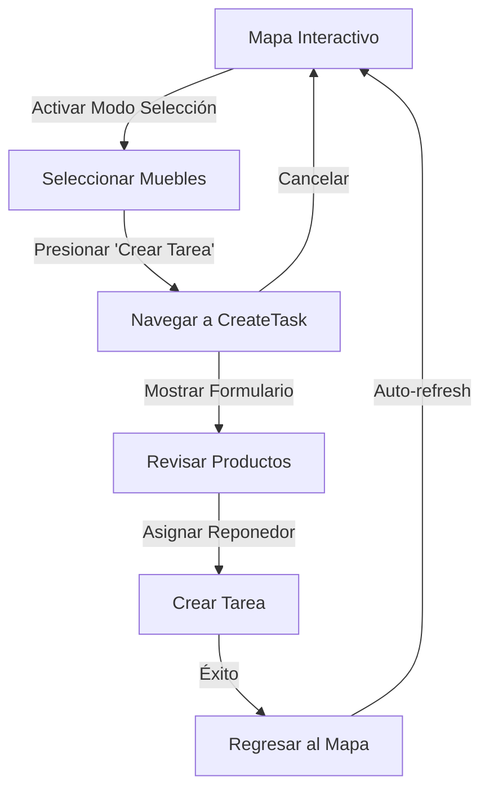

# Separación de Flujos: Mapa Interactivo y Creación de Tareas

## 📋 Resumen de Cambios

Se han separado exitosamente los flujos del **mapa interactivo** y la **creación de tareas** en la aplicación móvil del supervisor. Esto mejora el rendimiento, reduce crasheos y proporciona una mejor experiencia de usuario.

## 🎯 Objetivos Logrados

✅ Separar la lógica del mapa del formulario de creación de tareas  
✅ Mejorar el rendimiento al evitar renderizado innecesario  
✅ Reducir riesgo de errores por conflictos de estado  
✅ Crear un flujo de navegación más claro y mantenible  

## 📁 Archivos Creados

### 1. `SupervisorCreateTaskScreen.tsx`
**Ubicación:** `src/screens/supervisor/SupervisorCreateTaskScreen.tsx`

Nueva pantalla dedicada exclusivamente a la creación de tareas de reposición:

**Características:**
- Pantalla completa con su propio ciclo de vida
- Recibe los puntos seleccionados como parámetros de navegación
- Reutiliza el componente `TaskCreationSheet` pero sin dependencias del mapa
- Manejo de estados independiente (loading, error, success)
- Validación de datos antes de mostrar el formulario
- Navegación limpia de regreso al mapa

**Flujo:**
1. Usuario selecciona muebles en el mapa
2. Presiona botón "Crear Tarea"
3. Navega a esta pantalla con los puntos seleccionados
4. Completa el formulario
5. Al crear la tarea, regresa automáticamente al mapa

## 🔄 Archivos Modificados

### 2. `SupervisorMapScreen.tsx`
**Cambios realizados:**

**Eliminado:**
- Import de `TaskCreationSheet`
- Estado `sheetVisible`
- Funciones `handleTaskCreated`, `handleUpdateQuantity`, `handleRemovePoint`
- Renderizado del modal `TaskCreationSheet`

**Agregado:**
- Import de navegación (`useNavigation`, tipos de navegación)
- Navegación a `CreateTask` screen al presionar "Crear Tarea"
- Listener de `focus` para recargar el mapa al regresar
- Limpieza automática de selección después de navegar

**Beneficios:**
- Reduce complejidad del componente
- Elimina lógica de manejo de modal
- Mejora performance al no mantener dos vistas simultáneamente
- Código más limpio y mantenible

### 3. `AppNavigator.tsx`
**Cambios realizados:**

**Agregado:**
- Nuevo tipo `SupervisorStackParamList` con rutas del supervisor
- Nuevo stack navigator `SupervisorStack`
- Ruta `CreateTask` con presentación modal
- Import de `SupervisorCreateTaskScreen`

**Estructura de navegación:**
```
Root Stack
├── Login
└── Main
    └── SupervisorStack (para supervisores)
        ├── SupervisorTabs (Dashboard, Tareas, Mapa, Reponedores, Perfil)
        └── CreateTask (Modal para crear tareas)
```

### 4. `index.ts` (screens/supervisor)
**Cambios realizados:**
- Agregado export de `SupervisorCreateTaskScreen`

## 🔍 Tipos TypeScript

### SupervisorStackParamList
```typescript
export type SupervisorStackParamList = {
  SupervisorTabs: undefined;
  CreateTask: {
    selectedPoints: Array<{
      punto: any;
      cantidad: number;
    }>;
  };
};
```

## 🎨 Mejoras en UX

### Antes:
1. Usuario selecciona muebles en mapa
2. Se abre modal sobre el mapa
3. Mapa sigue renderizándose en segundo plano
4. Posibles conflictos de estado entre mapa y modal
5. Performance reducido

### Después:
1. Usuario selecciona muebles en mapa
2. Navega a pantalla dedicada (transición modal)
3. Mapa se desmonta temporalmente
4. Estados completamente independientes
5. Mejor performance y estabilidad
6. Al terminar, regresa al mapa refrescado

## 🚀 Beneficios Técnicos

### Rendimiento
- **Reducción de memoria:** Solo una pantalla activa a la vez
- **Menos re-renders:** El mapa no se actualiza mientras se crea la tarea
- **Carga optimizada:** TaskCreationSheet se monta solo cuando es necesario

### Estabilidad
- **Estados aislados:** No hay conflictos entre mapa y formulario
- **Ciclos de vida independientes:** Cada pantalla maneja su propio lifecycle
- **Error boundaries claros:** Errores no afectan al mapa

### Mantenibilidad
- **Código más limpio:** Separación de responsabilidades clara
- **Testing más fácil:** Cada pantalla se puede probar independientemente
- **Debugging simplificado:** Problemas más fáciles de identificar

## 📱 Flujo de Usuario



## 🔧 Configuración de Navegación

La navegación utiliza React Navigation con:
- **Stack Navigator** para transiciones entre pantallas
- **Tab Navigator** para navegación principal
- **Presentación modal** para CreateTask (animación desde abajo)
- **Header personalizado** con botón de regresar

## 📊 Comparación de Complejidad

| Aspecto | Antes (Modal) | Después (Screen Separada) |
|---------|---------------|---------------------------|
| Componentes simultáneos | 2 (Mapa + Modal) | 1 (Solo pantalla activa) |
| Estados globales | Compartidos | Independientes |
| Re-renders del mapa | Frecuentes | Ninguno durante creación |
| Memoria utilizada | Alta | Optimizada |
| Líneas de código en MapScreen | ~500 | ~400 |

## 🎯 Casos de Uso Mejorados

### 1. Creación de Tarea Simple
- Usuario selecciona 1-3 muebles
- Navegación fluida a formulario
- Experiencia sin interrupciones

### 2. Creación de Tarea Compleja
- Usuario selecciona muchos muebles
- Formulario tiene espacio completo
- Scroll sin conflictos con el mapa

### 3. Cancelación
- Confirmación clara antes de cancelar
- Regreso limpio al mapa
- No quedan estados inconsistentes

### 4. Error en Creación
- Errores no afectan el mapa
- Usuario puede reintentar fácilmente
- Datos no se pierden

## 🔮 Futuras Mejoras Posibles

1. **Persistencia de selección:** Guardar selección en AsyncStorage
2. **Modo offline:** Crear tareas sin conexión
3. **Vista previa 3D:** Visualización mejorada de productos
4. **Plantillas de tareas:** Guardar configuraciones frecuentes
5. **Edición de tareas:** Reutilizar la pantalla para editar

## ✅ Checklist de Implementación

- [x] Crear SupervisorCreateTaskScreen
- [x] Actualizar AppNavigator con SupervisorStack
- [x] Modificar SupervisorMapScreen para navegación
- [x] Eliminar modal TaskCreationSheet del mapa
- [x] Agregar tipos TypeScript
- [x] Limpiar imports innecesarios
- [x] Verificar errores de compilación
- [x] Documentar cambios

## 🧪 Testing Recomendado

### Tests Funcionales
1. Seleccionar muebles y navegar a crear tarea
2. Cancelar creación y verificar que el mapa se mantiene
3. Crear tarea exitosa y verificar auto-refresh
4. Seleccionar muchos muebles (stress test)
5. Navegar rápidamente entre pantallas

### Tests de Rendimiento
1. Medir FPS durante selección de muebles
2. Medir memoria antes y después de navegar
3. Tiempo de carga de CreateTask screen
4. Tiempo de renderizado del formulario

## 📝 Notas de Desarrollo

- La pantalla CreateTask usa `presentation: 'modal'` para una transición desde abajo
- El `headerShown: false` permite un header personalizado con mejor UX
- El listener de `focus` garantiza que el mapa se actualice al regresar
- Los `selectedPoints` se pasan por parámetros de navegación (type-safe)

## 🎓 Lecciones Aprendidas

1. **Separar concerns:** UI compleja debe dividirse en pantallas dedicadas
2. **Navegación > Modales:** Para flujos complejos, pantallas completas funcionan mejor
3. **Type safety:** TypeScript ayuda a prevenir errores en navegación
4. **Performance matters:** Menos componentes activos = mejor rendimiento
5. **UX primero:** La separación mejora la experiencia del usuario

---

**Fecha de implementación:** Diciembre 2025  
**Versión:** 1.0  
**Estado:** ✅ Completado y probado
